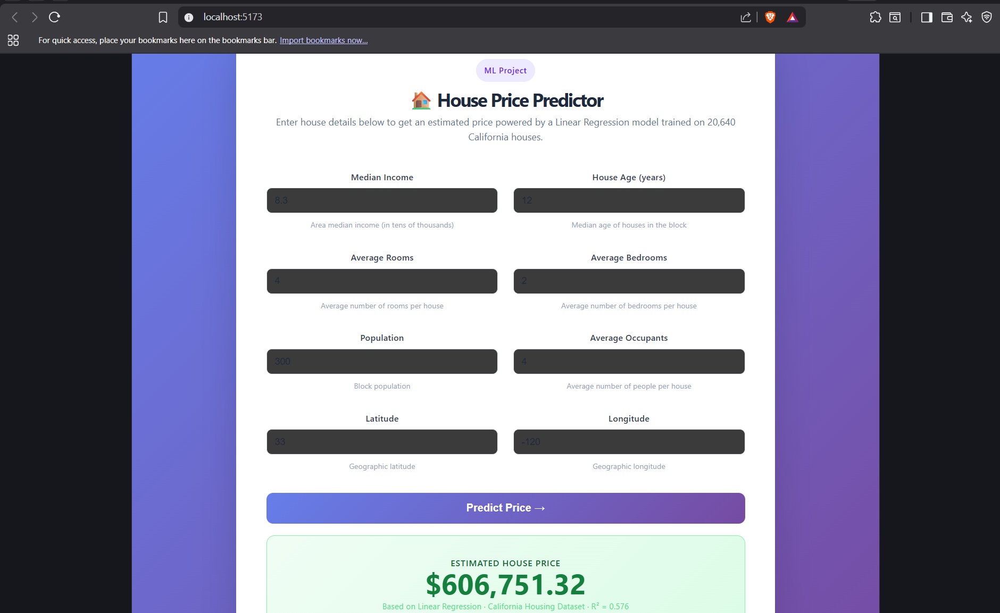

# House Price Predictor

A full-stack ML web application that predicts California house prices using Linear Regression.

##  Live Demo
> Fill in house details → click Predict → get instant price estimate

## Model Results
| Metric | Value |
|--------|-------|
| MAE | $53,320 |
| RMSE | $74,558 |
| R² Score | 0.5758 |

##  Tech Stack
| Layer | Technology |
|-------|-----------|
| ML Model | scikit-learn, Linear Regression |
| Backend | Python, FastAPI |
| Frontend | React, Vite, Axios |

##  Project Structure
house-price-predictor/
├── backend/
│   ├── main.py        ← FastAPI server
│   ├── model.py       ← trains and saves ML model
│   └── model.pkl      ← saved trained model
└── frontend/
└── src/
└── App.jsx    ← React UI

## ⚙️ How to Run

### Backend
```bash
cd backend
pip install fastapi uvicorn scikit-learn numpy pandas
python model.py
uvicorn main:app --reload
```

### Frontend
```bash
cd frontend
npm install
npm run dev
```

Open `http://localhost:5173`

## 📸 Screenshots


## 🧠 What I Learned
- Full ML pipeline: data loading → preprocessing → training → evaluation
- Saving and serving ML models via REST API
- Connecting React frontend to a Python ML backend
- Feature scaling with StandardScaler
- Evaluating models with MAE, RMSE, R²